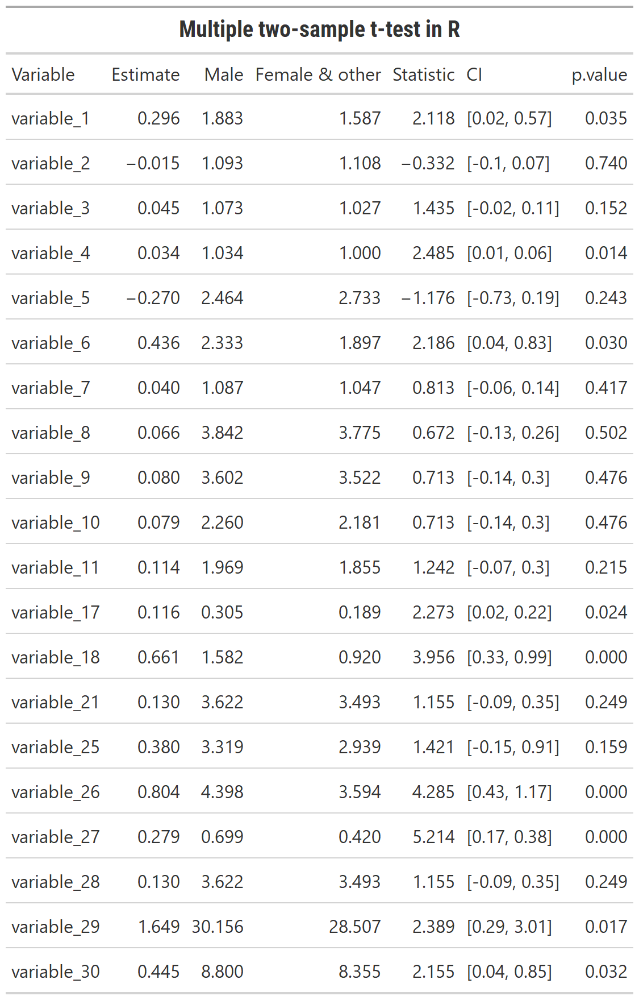

Iterated two-sample t-test
================
9/3/2020

In a [Student’s
t-test](https://en.wikipedia.org/wiki/Student%27s_t-test) we can test
whether our sample’s statistic is significantly different from the
population, and whether two groups’ means significantly differ (That is,
we reject the null hypothesis that they’re from the same population and
the difference is 0).

After learning SPSS in my undergrad I found R’s iterating ability
amazing. When the time came and I had to analyze some of my survey data
I wanted to test difference between two groups across many variables.
Knowing something like this is possible in R, I came across this exact
question in the [rstudio community
website](https://community.rstudio.com/t/use-dplyr-to-do-grouped-t-tests-and-get-number-of-observations-simultanously/23561)
where [Tyler Bradley](https://community.rstudio.com/u/tbradley) provided
an elegant solution.

## Simulated data

Let’s see his solution and then see some minor revisions I adopted for a
‘real world case’ (A simulated pilot survey).

``` r
library('tidyverse')
library('broom')

set.seed(354654)
d = tibble(value = rnorm(100),
           category = sample(1:5, replace = TRUE, 100),
           group = sample(c('A', 'B'), replace = TRUE, 100)) %>% 
  arrange(category)

d
```

    ## # A tibble: 100 x 3
    ##     value category group
    ##     <dbl>    <int> <chr>
    ##  1  0.401        1 A    
    ##  2 -1.12         1 B    
    ##  3  1.41         1 A    
    ##  4 -0.614        1 A    
    ##  5  0.222        1 B    
    ##  6  0.479        1 A    
    ##  7  0.672        1 B    
    ##  8  1.16         1 B    
    ##  9  0.743        1 A    
    ## 10  0.215        1 A    
    ## # ... with 90 more rows

``` r
d %>% 
  group_by(category, group) %>% 
  nest() %>% 
  spread(key = group, value = data) %>% 
  mutate(
    t_test = map2(A, B, ~{t.test(.x$value, .y$value) %>% tidy()}),
    A = map(A, nrow),
    B = map(B, nrow)
  ) %>% 
  unnest()
```

    ## # A tibble: 5 x 13
    ## # Groups:   category [5]
    ##   category     A     B estimate estimate1 estimate2 statistic p.value parameter
    ##      <int> <int> <int>    <dbl>     <dbl>     <dbl>     <dbl>   <dbl>     <dbl>
    ## 1        1    10    10  -0.0625    0.374     0.437     -0.184   0.856     18.0 
    ## 2        2     7     6   0.126     0.0553   -0.0709     0.375   0.717      7.98
    ## 3        3     8     9  -0.497    -0.436     0.0611    -0.881   0.395     12.6 
    ## 4        4    15    11   0.157     0.222     0.0641     0.408   0.687     22.5 
    ## 5        5    11    13  -0.0798   -0.297    -0.217     -0.190   0.851     21.3 
    ## # ... with 4 more variables: conf.low <dbl>, conf.high <dbl>, method <chr>,
    ## #   alternative <chr>

Great answer, basically nesting the data for each category, spreading
the categories to distinct columns and using `map2` to run a two-sample
t-test.

## Using ‘real’ survey data

My data required only minor adaptations, but let’s try it with
additional simulated data too:

``` r
d = tibble(response1 = rnorm(100),
           response2 = rnorm(100),
           response3 = rnorm(100),
           response4 = rnorm(100),
           group = sample(c('A', 'B'), replace = TRUE, 100))

d[1:3,2] <- NA
d[5,2:4] <- NA

d
```

    ## # A tibble: 100 x 5
    ##    response1 response2 response3 response4 group
    ##        <dbl>     <dbl>     <dbl>     <dbl> <chr>
    ##  1  -1.31      NA         -0.574    0.0374 B    
    ##  2   0.958     NA         -0.391   -0.948  A    
    ##  3  -0.803     NA          0.444   -0.805  B    
    ##  4   0.00455   -0.0326    -0.592    2.88   A    
    ##  5  -0.373     NA         NA       NA      B    
    ##  6  -1.43      -0.0591    -0.840   -0.315  A    
    ##  7  -0.598     -0.0277    -0.403   -0.594  A    
    ##  8  -2.25       0.965     -0.404   -0.449  A    
    ##  9  -1.19      -0.125      0.903    2.06   A    
    ## 10  -0.170      0.372     -2.13    -1.72   A    
    ## # ... with 90 more rows

This better represents a ‘wide’ survey response, with several values
being NA. Let’s first prepare our data:

``` r
d_t_test <- d %>% 
  # If you only want to retain numeric columns
  select(group,where(is.numeric)) %>%  
  # Convert to long format
  pivot_longer(-group, names_to = "variable_long") %>% 
  # Filter if your categorical variable is NA
  filter(!is.na(group))
```

And now nest all the variables in two different columns for each group,
similar to his approach:

``` r
d_t_test <- d_t_test %>% 
  group_by(variable_long, group ) %>% 
  nest() %>% 
  pivot_wider(names_from = group, values_from = data) 

d_t_test
```

    ## # A tibble: 4 x 3
    ## # Groups:   variable_long [4]
    ##   variable_long B                 A                
    ##   <chr>         <list>            <list>           
    ## 1 response1     <tibble [51 x 1]> <tibble [49 x 1]>
    ## 2 response2     <tibble [51 x 1]> <tibble [49 x 1]>
    ## 3 response3     <tibble [51 x 1]> <tibble [49 x 1]>
    ## 4 response4     <tibble [51 x 1]> <tibble [49 x 1]>

And finally run the test:

``` r
d_t_test %>% 
  mutate(
    t_test = map2(A, B , ~{t.test(.x$value, .y$value) %>% tidy()}),
    n_group_A = map_dbl(`A`, ~ sum(!is.na(.x))),
    n_group_B = map_dbl(`B`, ~ sum(!is.na(.x)))
  ) %>% 
  unnest(t_test) %>% 
  mutate(CI = paste0("[", round(conf.low,2), ", ",round(conf.high,2), "]")) %>% 
  select(Variable = variable_long, Estimate = estimate, `Group A` = estimate1, `Group B` = estimate2, Statistic = statistic, CI, p.value, n_group_A, n_group_B) %>% 
  arrange(p.value) %>% 
  knitr::kable()
```

| Variable  |    Estimate |     Group A |     Group B |   Statistic | CI              |   p.value | n\_group\_A | n\_group\_B |
| :-------- | ----------: | ----------: | ----------: | ----------: | :-------------- | --------: | ----------: | ----------: |
| response1 | \-0.2696169 | \-0.1198207 |   0.1497962 | \-1.3514395 | \[-0.67, 0.13\] | 0.1796673 |          49 |          51 |
| response3 | \-0.0760155 | \-0.0672744 |   0.0087411 | \-0.3632480 | \[-0.49, 0.34\] | 0.7172290 |          49 |          50 |
| response2 |   0.0355152 | \-0.0732265 | \-0.1087417 |   0.1713817 | \[-0.38, 0.45\] | 0.8642921 |          48 |          48 |
| response4 |   0.0129523 |   0.0755937 |   0.0626414 |   0.0648348 | \[-0.38, 0.41\] | 0.9484393 |          49 |          50 |

And Voila, along with some tidying and arranging our p-values. I did
have to provide columns within the `unnest`, and running only a `map`
argument and not `map_dbl` returned a list value as a cell so I changed
it the `map_dbl`.

Another thing to note is the use of `~ sum(!is.na(.x))` instead of
`nrow`. This is because the nrow will count `NA` as valid values, and we
want only values run in the t-test analysis.

And here’s the code to save it as a table (run on a larger fabricated
dataset):

``` r
table_print <- df_t_test %>%
  head(20) %>% 
  gt::gt() %>% 
  fmt_number(
    columns = c(2:5,7),
    decimals = 3,
    use_seps = FALSE
  ) %>% 
  tab_header(
    title = html("<b><span style='font-family:Roboto Condensed'>Multiple two-sample t-test in R</span></b>")
    ) %>%
  tab_options(heading.title.font.weight = "bold") 

gtsave(table_print, "table.png")
```

``` r

```


**That’s the short tip, hopefully it helped someone else\! And thanks to
Tyler\!**
